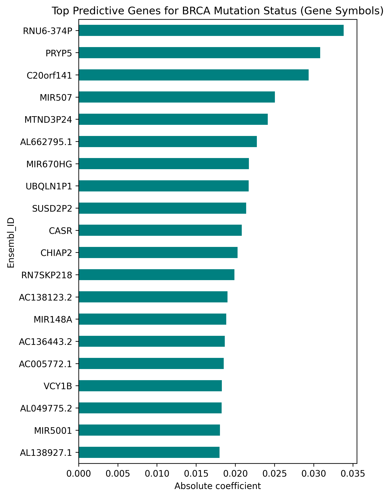

# AI-BRCA-Predictor
Predicting BRCA1/2 mutation status from TCGA gene expression data using machine learning.

🧬 BRCA-Mutation-ML

Predicting BRCA1/2 Mutation Status from TCGA Breast Cancer Gene Expression Using Machine Learning

📘 Overview

This project uses TCGA Breast Cancer (BRCA) data to predict whether a tumor carries BRCA1 or BRCA2 mutations based on its gene expression and clinical features.
By applying modern machine learning and AI techniques, the study explores how expression and phenotype data can be integrated for mutation detection and biomarker discovery in precision oncology.

⚙️ Workflow Summary

Data Sources:

TCGA-BRCA gene expression (RNA-seq, FPKM)

Somatic mutation data (MAF)

Clinical data (age, tumor stage, grade, recurrence, treatment)

Preprocessing Steps:

Merged mutation and expression matrices

Extracted BRCA1/2 mutation status (binary label)

Filtered top 1,000 most variable genes

Addressed class imbalance using SMOTE

One-hot encoded and imputed clinical variables

Machine Learning Models:

Logistic Regression (baseline)

Random Forest

XGBoost

Combined gene expression + clinical data

## 📊 Results

| Model | Features Used | Accuracy | AUC |
|:------|:---------------|:---------|:----|
| Logistic Regression | Gene Expression | — | 0.55 |
| Random Forest | Gene Expression | — | 0.65 |
| XGBoost | Gene Expression | — | 0.62 |
| Random Forest + Clinical | Expression + Clinical | 0.96 | 0.67 |

🔍 Key Insights

Adding clinical features slightly improved prediction performance (AUC ↑ from 0.65 → 0.67).

Random Forest captured nonlinear relationships better than Logistic Regression.

Top predictive genes (mapped from Ensembl IDs) highlight expression patterns linked to BRCA1/2 mutation biology.

Demonstrates the potential of AI-assisted genomics for clinical decision support.

💡 Future Improvements

Use larger cohorts or pan-cancer data for better generalization.

Apply deep learning (e.g., autoencoders, transformers) for multi-omics fusion.

Include DNA methylation and copy number profiles to refine mutation prediction.

Integrate survival outcomes for prognostic modeling.

🧠 Importance

This study shows how AI and bioinformatics can be combined to interpret omics data and support precision oncology.
By predicting BRCA mutation status directly from gene expression and clinical profiles, such pipelines can assist in:

Early identification of high-risk patients

Biomarker discovery

Personalized therapeutic decisions

